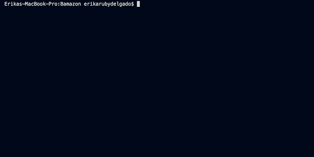

# Bamazon

## Bamazon // Your favorite place to shop it out!

What is it? Bamazon is a backend-based app where a user is essentially shopping, the application has two different viewing options for now,the customer view, and the manager's view, the user will go through a variety of prompts helping the user out in their shopping journey.

-------------------
Welcome to the Bamazon Customer Screen
-------------------

In the Customer Viewing path of our application, users will choose the product they desire by simply filling in the prompts displayed. A table of Bamazon's data will also be shown to showcase products in stock today.

A glipse of the customer view can be seen here:

-------------------
Welcome to the Bamazon Manager Screen
-------------------

In the Manager Viewing path of our application, users will have more abilities in the Bamazon shop, including the View Products For Sale, Add New Product, View Low Inventory, and Add To Inventory screens, giving them acces sto do as they please with their shop.

### Customer 

-------------------

Technology Used:

* mySQL

* Node.js
